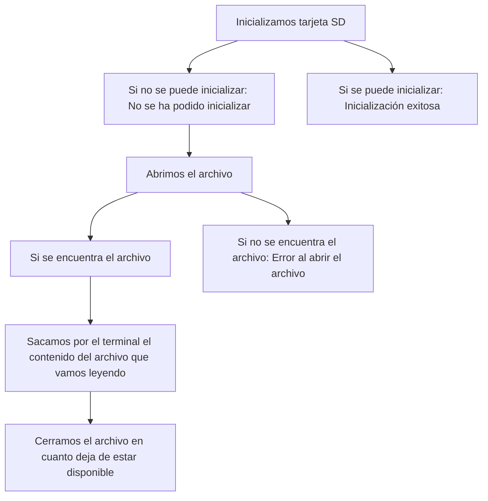
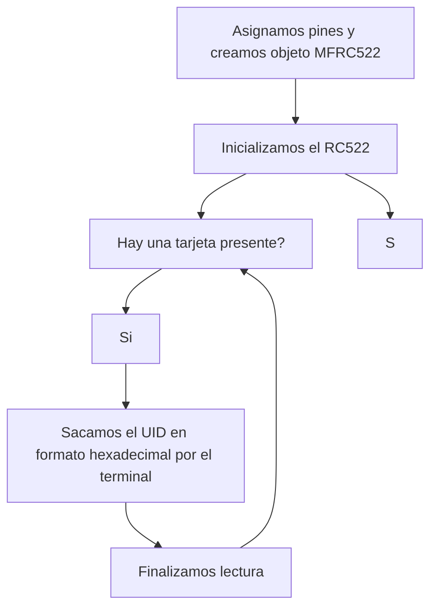

# Práctica 6: Procesadores digitales
<div align="justify">
## Objetivo
El objetivo de esta práctica consistirá en entender el bus SPI y sus aplicaciones. Para ello, utilizaremos un lector RFID y un lector de tarjetas SD. Ambos periféricos funcionan con comunicación SPI. Nos dedicaremos a leer y a escribir información en una tarjeta SD y a ver el funcionamiento de la lectura RFID.

## Lectura-escritura de memoria SD

Para que el código funcione, debemos incluir las siguientes librerías y declarar una variable tipo `File`.
```cpp
#include <SPI.h>
#include <SD.h>
File myFile;
```
Dentro del ``setup()``, inicializamos a una velocidad de `112500` e informamos por el terminal si se ha podido establecer la connexión. Como sabemos que la línea adicional SS (Slave Select) se debe asignar al pin 5, cuando queremos comprobar si el lector está connectado, debemos poner la condición para ese mismo pin.
```cpp
  Serial.begin(115200);
  Serial.print("Iniciando SD ...");
  if (!SD.begin(5)) {
    Serial.println("No se pudo inicializar");
    return;
  }
  Serial.println("inicializacion exitosa");
```
A continuación, abrimos el archivo dentro la memoria y mientras este esté disponible, escribimos por el terminal su contenido. En cuanto deja de estar disponible, simplemente cerramos el archivo. En caso de que no encuentre el archivo, informamos al usuario que ha habido un error al abrir el archivo.
```cpp
  myFile = SD.open("archivo.txt");//abrimos el archivo
  if (myFile) {
    Serial.println("archivo.txt:");
    while (myFile.available()) {
      Serial.write(myFile.read());
    }
  myFile.close(); //cerramos el archivo
  } 
  else {
    Serial.println("Error al abrir el archivo");
  }
```
Dentro del `loop()` no necesitamos escribir funciones, por lo que el código queda como el siguiente. 
```cpp
#include <SPI.h>
#include <SD.h>
File myFile;
void setup(){
  Serial.begin(115200);
  Serial.print("Iniciando SD ...");
  if (!SD.begin(5)) {
    Serial.println("No se pudo inicializar");
    return;
  }
  Serial.println("inicializacion exitosa");
  myFile = SD.open("archivo.txt");
  if (myFile) {
    Serial.println("archivo.txt:");
    while (myFile.available()) {
      Serial.write(myFile.read());
    }
  myFile.close();
  } 
  else {
    Serial.println("Error al abrir el archivo");
  }
}
void loop()
{
}
```
Con una salida:
```
Iniciando SD ...
inicializacion exitosa
archivo.txt:
hola :)
fitxer de prova
```
### Diagrama de flujo


## Lectura de etiqueta RFID

En primer lugar, incluimos la librería de SPI y MFRC522 y definimos los pines con los que trabajaremos.
```cpp
#include <SPI.h>
#include <MFRC522.h>

#define RST_PIN	27    //para el reset del RC522
#define SS_PIN	5   //para el SS (SDA) del RC522
```
En segundo lugar, creamos el objeto para el módulo RC522.
```cpp
MFRC522 mfrc522(SS_PIN, RST_PIN);
```
Ya dentro del `setup()`, iniciamos la comunicación serial, el bus SPI y el MFRC522.
```cpp
  Serial.begin(112500); 
  SPI.begin();
	mfrc522.PCD_Init();
```
Una vez hecho, en el bucle miramos si hay alguna tarjeta presente cerca del módulo. 
```cpp
if ( mfrc522.PICC_IsNewCardPresent()) 
```
Si la hay, la intenta seleccionar para poder leerla. 
```cpp
if ( mfrc522.PICC_ReadCardSerial())
```
Si consigue hacerlo, se crea un bucle que permite devolver el código de identificación de cada tarjeta, sacandolo por el terminal a medida que se va leyendo. Mientras el índice no haya recorrido todo el uid, el bucle no se detiene. 
```cpp
for (byte i = 0; i < mfrc522.uid.size; i++) {
                          Serial.print(mfrc522.uid.uidByte[i] < 0x10 ? " 0" : " ");
                          Serial.print(mfrc522.uid.uidByte[i], HEX);   
                  } 
```
En cuanto terminamos, finalizamos el proceso de lectura, considerando como tarjeta nueva una ya leída en cuanto la alejamos del lector.
```cpp
 mfrc522.PICC_HaltA(); 
```
Por lo tanto, el código es el siguiente:
```cpp
#include <SPI.h>
#include <MFRC522.h>

#define RST_PIN	27
#define SS_PIN	5
MFRC522 mfrc522(SS_PIN, RST_PIN);

void setup() {
  Serial.begin(112500); 
  SPI.begin();
	mfrc522.PCD_Init();
	Serial.println("Lectura del UID");
}

void loop() {
	if ( mfrc522.PICC_IsNewCardPresent()) 
        {  
            if ( mfrc522.PICC_ReadCardSerial()) 
            {
                  Serial.print("Card UID:");
                  for (byte i = 0; i < mfrc522.uid.size; i++) {
                          Serial.print(mfrc522.uid.uidByte[i] < 0x10 ? " 0" : " ");
                          Serial.print(mfrc522.uid.uidByte[i], HEX);   
                  } 
                  Serial.println();
                  mfrc522.PICC_HaltA();         
            }      
	}	
}
```
Y la salida por el terminal la siguiente:
```
Lectura del UID
Card UID: F5:4A:31:B2
Card UID: 12:2D:E0:A2
```

### Diagrama de flujo



https://mermaid.js.org/syntax/flowchart.html